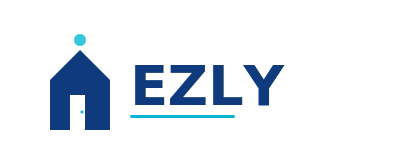

# EZLY Creative Assets

**Logo Suite & Design Files**

---

## 📦 Contents

This folder contains all official EZLY logos and creative assets.

### Logo Files (SVG Format)

All logos are production-ready vector files. They're infinitely scalable and fully editable.

#### Primary Logos

1. **EZLY-Logo-Combined.svg** ⭐ RECOMMENDED
   - Icon + Wordmark together
   - **Use for**: Website headers, business cards, presentations, primary branding
   - **Colors**: Navy (#0F3A7D) + Teal (#06B6D4)
   - **Size**: 400x150px (scalable)

2. **EZLY-Logo-Icon.svg**
   - Connected House Mark (icon only)
   - **Use for**: App icons, favicons, social avatars, badges
   - **Colors**: Navy + Teal
   - **Size**: 200x200px (scalable, works from 32px to 512px+)

3. **EZLY-Logo-Wordmark.svg**
   - Modern EZLY typography (text only)
   - **Use for**: Email signatures, document headers, email templates
   - **Colors**: Navy + Teal accent
   - **Size**: 500x150px (scalable)

#### Supporting Variations

4. **EZLY-Logo-Icon-Square.svg**
   - Square format (1:1 aspect ratio)
   - **Use for**: Favicon (16x16, 32x32, 64x64), social media avatars (400x400px)
   - **Colors**: Navy + Teal
   - **Size**: 180x180px (scalable)

5. **EZLY-Logo-Monochrome.svg**
   - Navy only (single color)
   - **Use for**: Business cards, letterhead, official documents, B&W printing
   - **Colors**: Navy (#0F3A7D)
   - **Advantage**: High contrast, print-ready

6. **EZLY-Logo-White.svg**
   - White knockout version
   - **Use for**: Dark website sections, dark backgrounds, colored section headers
   - **Colors**: White (#FFFFFF) on dark background
   - **Note**: Includes dark background preview (can be removed)

---

## 🎨 Brand Colors

| Color | Hex | RGB | Usage |
|-------|-----|-----|-------|
| Navy (Primary) | #0F3A7D | 15, 58, 125 | Main buttons, text, headings |
| Teal (Accent) | #06B6D4 | 6, 182, 212 | Highlights, icons, accents |
| Orange (Secondary) | #F97316 | 249, 115, 22 | Secondary emphasis (not used in logos) |

---

## 🚀 How to Use

### In Code (HTML/Web)
```html
<!-- Embed SVG -->


<!-- Or as CSS background -->
<div style="background-image: url('EZLY-Logo-Combined.svg')"></div>

<!-- Favicon -->
<link rel="icon" type="image/svg+xml" href="EZLY-Logo-Icon-Square.svg">
```

### In Design Tools
- **Figma**: File → Import → Select SVG file
- **Adobe Illustrator**: File → Open → Select SVG
- **Canva**: Upload SVG file
- **Adobe XD**: File → Import → Select SVG

### Convert to PNG (if needed)
1. Open SVG in browser
2. Right-click → Save as image (PNG)
3. Or use online converter: cloudconvert.com, convertio.co

### For Print
- Use **EZLY-Logo-Monochrome.svg** for B&W printing
- Use **EZLY-Logo-Combined.svg** for color printing
- Export at 300 DPI for high-quality prints

---

## 📏 Sizing Guidelines

### Icon Logo (Icon.svg)
- Minimum: 32px
- Small badge: 64px
- Medium: 128px
- Large: 256px
- Extra large: 512px+

### Wordmark (Wordmark.svg)
- Minimum width: 150px
- Website header: 300-400px
- Document header: 500px
- Print: 1000px+

### Combined Logo (Combined.svg)
- Minimum width: 200px
- Website header: 400px
- Presentations: 800px
- Print: 1200px+

### Icon Square (Icon-Square.svg)
- Favicon: 32x32px
- Small avatar: 64x64px
- App icon: 128x128px, 256x256px
- Social avatar: 400x400px, 512x512px

---

## ✅ Usage Checklist

### Website Implementation
- [ ] Add Combined logo to header
- [ ] Add Icon-Square as favicon
- [ ] Add Wordmark to email templates
- [ ] Add Icon to buttons/badges
- [ ] Add White logo to dark sections

### Business Materials
- [ ] Business cards (use Icon-Square + Wordmark)
- [ ] Letterhead (use Monochrome)
- [ ] Envelopes (use Icon-Square or Wordmark)
- [ ] Invoice headers (use Wordmark)

### Digital Marketing
- [ ] Social media avatar (use Icon-Square, 400x400px)
- [ ] Email signature (use Wordmark)
- [ ] Email header (use Combined)
- [ ] Blog post header (use Wordmark or Icon)
- [ ] LinkedIn profile (use Icon-Square)

### Print Materials
- [ ] Brochures (use Combined)
- [ ] Flyers (use Combined)
- [ ] Posters (use Combined)
- [ ] Signage (use Combined or Icon)
- [ ] Stickers (use Icon or Icon-Square)

---

## 📝 Logo Usage Rules

### DO ✅
- Use approved logo files only
- Maintain clear space around logo (10-15px)
- Scale proportionally (don't distort)
- Use correct color variations
- Place on sufficient contrast backgrounds
- Keep shape and proportions intact

### DON'T ❌
- Distort or stretch logos
- Add effects (shadows, 3D effects)
- Change colors arbitrarily
- Rotate or skew
- Use low-resolution versions
- Combine with competing imagery
- Violate clear space guidelines

---

## 🔧 Editing & Customization

All SVG files are plain text and can be edited:

1. **In any code editor**: Open .svg file, edit colors/text
2. **In design tools**: Import and edit visually
3. **Change colors**: Find hex codes (#0F3A7D, #06B6D4) and replace

**Example: Change Navy to a different color**
- Open SVG in text editor
- Find `#0F3A7D`
- Replace with desired hex code
- Save and refresh

---

## 📄 Related Files

For complete brand guidelines, see:
- `BRAND_GUIDELINES.md` - Full brand identity standards
- `COLOR_PALETTE.md` - All approved colors with specs
- `LOGO_CONCEPTS.md` - Logo design specifications
- `VOICE_AND_TONE.md` - Communication guidelines
- `TEMPLATES.md` - Marketing templates

---

## 🎯 Quick Reference

| Need | Use This File |
|------|---------------|
| Website header | EZLY-Logo-Combined.svg |
| App icon | EZLY-Logo-Icon.svg or Icon-Square.svg |
| Favicon | EZLY-Logo-Icon-Square.svg |
| Social avatar | EZLY-Logo-Icon-Square.svg |
| Email signature | EZLY-Logo-Wordmark.svg |
| Business card | EZLY-Logo-Icon-Square.svg |
| Printing (B&W) | EZLY-Logo-Monochrome.svg |
| Dark background | EZLY-Logo-White.svg |
| Presentation | EZLY-Logo-Combined.svg |
| Document header | EZLY-Logo-Wordmark.svg |

---

## 📞 Questions?

Refer to the main Marketing folder README or BRAND_GUIDELINES.md for more details.

---

**Last Updated**: March 9, 2026  
**Format**: SVG (Scalable Vector Graphics)  
**Status**: Production Ready ✅
